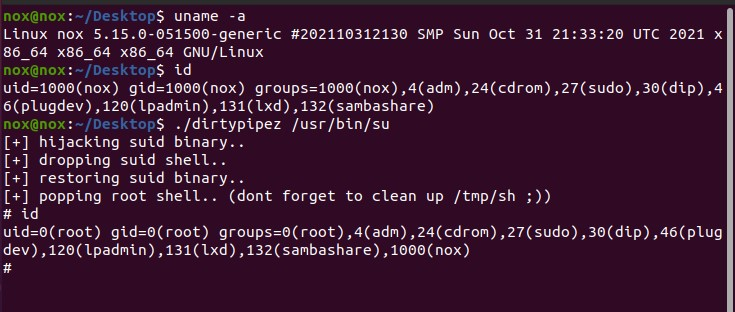

# The Great Pipe for Attackers — CVE-2022-0847

****Dirty Pipe - CVE-2022-0847 - Linux Privilege Escalation****

## **Executive Summary**

**Linux** is a very popular operating system for our digital environment. It has a wide range of use cases from refrigerators to supercomputers.  The most important web applications and services that are vital for companies and their users run on Linux-powered servers. And the most widely used mobile operating system Android is also a Linux distro.

There are three important reasons are behind in success of Linux.  First, Linux is open-source software and free to use. Second, It is very stable and efficient under pressure. And finally, It is considered a very safe operating system. But a vulnerability found by **Max Kellerman** hit the Linux community. Because this vulnerability has shown us an easy way to escalate privileges and take control of critical read-only system files in our safe and precious Linux operating system. 

## **Understanding Dirty Pipe**

Dirty Pipe is a local privilege escalation vulnerability affecting Linux kernel versions 5.8 or newer.  CVSS score of the vulnerability is 7.8 CVE-2022-0847 vulnerability is named Dirty Pipe because of its similarity to the Dirty Cow (CVE-2016-5195) vulnerability. 

In this case, a local attacker creates a pipe. After that copy some data into the pipe to set `PIPE_BUF_FLAG_CAN_MERGE` flag to 1 for all instances. After draining the pipe, The flag should have reset. The vulnerability occurs here because the flag stays the same after draining. An attacker could transfer a read-only system file to the pipe and modify it to escalate its privileges to the root level.  

## The I**mpact of Dirty Pipe**

The Linux systems which use Linux Kernel versions newer than 5.8 are affected. The vulnerability was patched with the following kernel versions. But the systems that are still running on the affected Kernel versions are vulnerable to critical conditions. This vulnerability gives attackers a chance to modify, and delete critical read-only files like /etc/shadow. It means that you can update 

Some Android mobile phones were affected **by Dirty Pipes** such as **the Pixel 6, Pixel 6 Pro, and Samsung Galaxy S22 series.  It means that any risky application which is not downloaded from a well-known source could follow this PoC to take control of the critical data of millions of android system users.** 

Linux is a widely used OS and its security is very critical for our safety on the internet : 

- 47% of professional developers use Linux-based operating systems.
- Linux powers 39.2% of websites whose operating system is known.
- Linux powers 85% of smartphones.

These statistics that are mentioned above show that these kinds of privilege escalation vulnerability could be very dangerous for our digital life or for the services we are using with our critical data.

## Proof of Concept: Dirty Pipe  Explained Step by Step

We will use the original scripts from Max Kellerman but simply be modified by Alexis Ahmed ( Github: AlexisAhmed).  

Before we start, we need to check our prerequisites for this exploit. First, we need to install the repositories on the local system. And we need to create and log in a non-privileged user which is not in `sudo` group. So we could test the exploit in a real case. Also, we need the GCC compiler installed to compile exploit scripts successfully. 

There are two opportunities in this exploit. 

- ****Modifying/overwriting read-only files (exploit-1.c)****
- ****Hijacking SUID binaries (exploit-2.c)****

Let's start with the first one. The aim is to use the piping vulnerability to gain access to modify /etc/shadow file and change the root password. After that, we will be able to create a new shell as the root user.  

- **Compile and download  the scripts :**

You can download scripts to the system by `git clone link` or direct download by `wget`. 

You can compile the scripts by the commands below : 

`gcc exploit-1.c -o exploit-1` 

`gcc exploit-2.c -o exploit-2`

Now You should have the compiled scripts ready. 

- **Running exploit-1  to gain root access :**

`./exploit-1` This command will change the root password to “piped” . and also take a backup of `etc/shadow` to the `/tmp` directory. 

After that, we can start a bash session by `/bin/bash -i` and run the commands as `root`. 

- **Finding read-only SUID privileged processes and hijacking them :**

Find the list of files with SUID privileges by running `find / -perm -4000 2>/dev/null` 

You can select `/usr/bin/sudo` from the output.  You can use `./exploit-2 /usr/bin/sudo`  to exploit the system . And know you will gain access to the control system as a root user. 

image source:  [https://access.redhat.com/security/cve/cve-2022-0847](https://access.redhat.com/security/cve/cve-2022-0847) 

## How To Prevent Dirty Pipe

Fortunately, the kernel updates have been published to fix this vulnerability.  To prevent our system’s attacked by this exploit, We should check our systems versions and update them accordingly. 

## Take The Control of Your Systems

These kinds of vulnerabilities are very easy to use against our digital safety. We have to start reading and be aware of these kinds of exploits to control our system very well. Whether it is solved by a kernel patch, There are lots of servers and Linux systems running on faulty kernel versions which are creating enough attack surfaces for the attackers. 

Sources : 

[https://www.androidpolice.com/dirty-pipe-explained/#:~:text=Dirty Pipe is the name,machine to be intermittently corrupted](https://www.androidpolice.com/dirty-pipe-explained/#:~:text=Dirty%20Pipe%20is%20the%20name,machine%20to%20be%20intermittently%20corrupted).

[https://github.com/AlexisAhmed/CVE-2022-0847-DirtyPipe-Exploits](https://github.com/AlexisAhmed/CVE-2022-0847-DirtyPipe-Exploits)

[https://www.picussecurity.com/resource/linux-dirty-pipe-cve-2022-0847-vulnerability-exploitation-explained](https://www.picussecurity.com/resource/linux-dirty-pipe-cve-2022-0847-vulnerability-exploitation-explained)

[https://truelist.co/blog/linux-statistics/](https://truelist.co/blog/linux-statistics/)

[https://dirtypipe.cm4all.com/](https://dirtypipe.cm4all.com/)